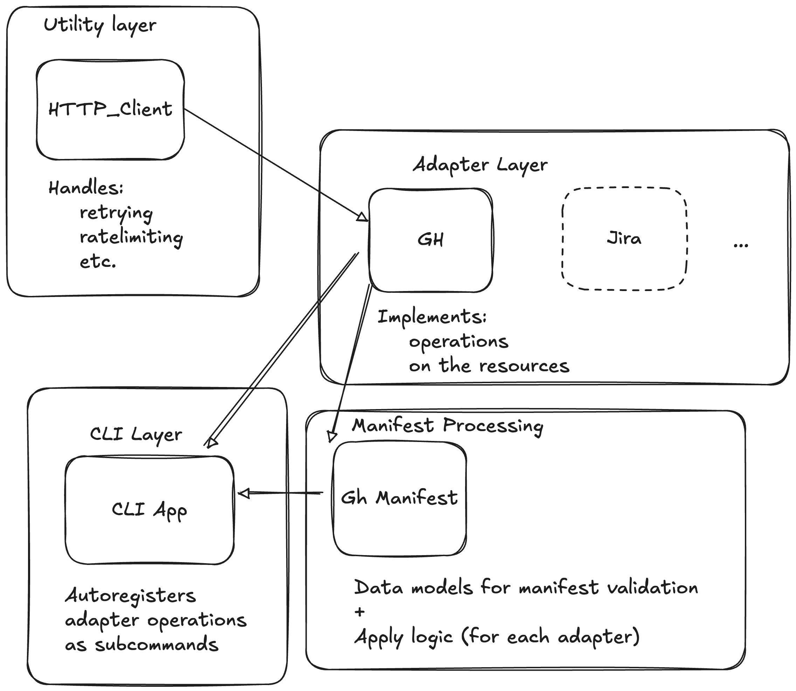

[](https://github.com/aateem/access-sync/actions/workflows/python-app.yml)

# Access Manager

## Overview
This project provides simplified automation for organization access policy management. Operating via concepts of `organizations`, `teams`, `repositories` and `team-members`.

Currently only GitHub adapter is supported which opperates on the assumption of exsing organizations and repositories (i.e. the automation would not create orgs, setup repos or invite external users to existing orgs).

The project provides cli interface for both "fine grained" resource management and "bulk" manifest update.

## Installation

### Prerequisites
- Python >= 3.12

### Setup
```bash
python -m venv venv
pip install -U pip
pip install .
pip install ".[test]"
```

## Usage
```bash
am --help
```
The adapters (currently GitHub only) are exposed as subcommands

### Manifest apply
```yaml
organizations:
  - name: org-name
    teams:
      - name: team-to-create-update
        repos:
          - name: repo-name
            owner: repo-owner
            permission: maintain
        members:
          - login: new-team-member-login
            role: member
```
Aply via:
```bash
am gh apply-manifest <path to the file above>
```

## Architecture

Subject to change



## Areas of improvements

- Add other adapters/manifest processors, e.g. Jira
- Currently the underlying HTTP client uses synchronous approach (due to GH REST API rate limiting considerations)
- Make adapter/manifest layer more abstract, e.g. maybe there are common operations, those could be added to the corresponding interfaces
- Manifest layer caching of remote state could be improved
- Expand the operation list
